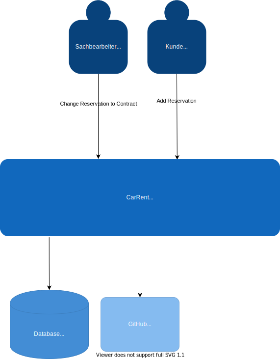
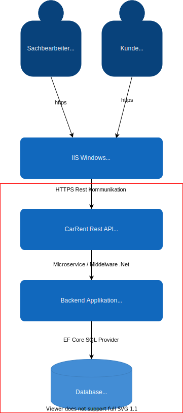
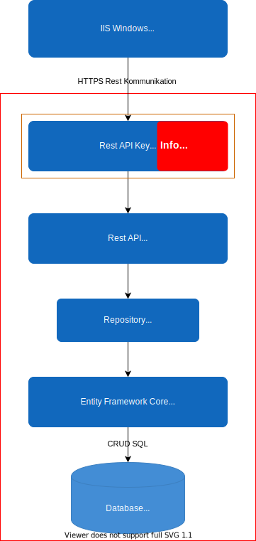
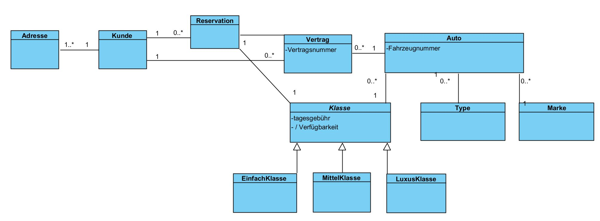
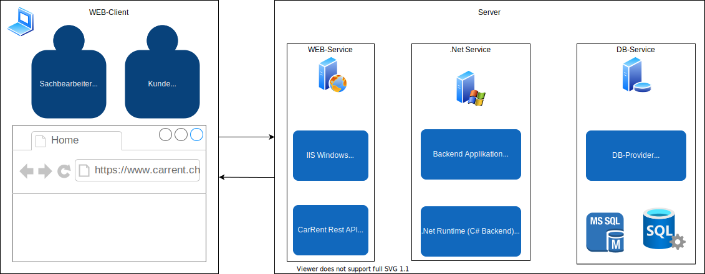
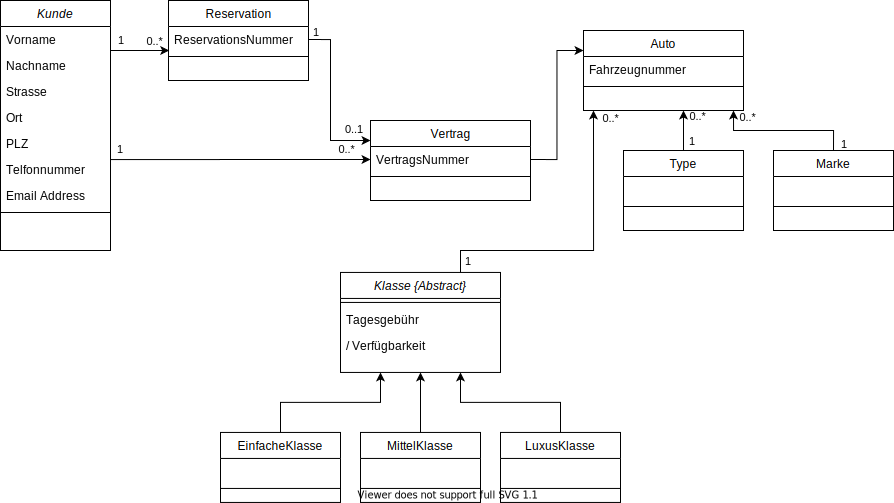
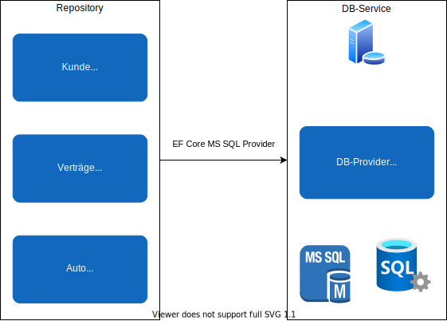

# CarRent
## 1. C4 Pattern

1. Context

    

1. Container

    

1. Component

    

## 2. Usecase

| Role           | Goal                                                         | Reason                                                       |
| -------------- | ------------------------------------------------------------ | ------------------------------------------------------------ |
| Sachbearbeiter | Kunde mit Name und Adresse erfassen/löschen/bearbeiten       | Kundendaten können genutz werden                             |
| Sachbearbeiter | Kunde anhand des Namen und Kundenummer suchen                | schnelles darstellen der Kundeninformationen                 |
| Sachbearbeiter | Autos verwalten und suchen                                   | Bestand der Autos stehtig aktuell halten                     |
| Sachbearbeiter | Auto einer bestimmten klasse und Type zuordnen               | eindeutige Identifikation                                    |
| Sachbearbeiter | Die Tagesgebür kann pro Klasse einsgestellt werden           | somit kann auf den aktuellen Markt reagiert werden           |
| Kunde          | Kunde kann Reservation tätigen, in dem er ein Auto aus einer Klasse wählt und sowie Start-/Enddatum wählt. | Die gesammtkosten können errechnet werden und eine Reservertionsnummer wird abgelegt. |
| Kunde          | Kunde holt sein Reserviertes Auto ab                         | Reservation wird in einen gültigen Mietvertrag umgewandelt.  |

## 3. Domain Model

## 4. Deployment View

## 5. Logic View

## 6. Implementation View
